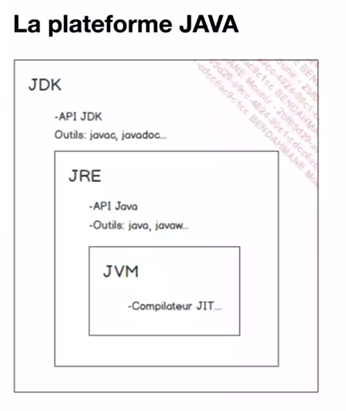
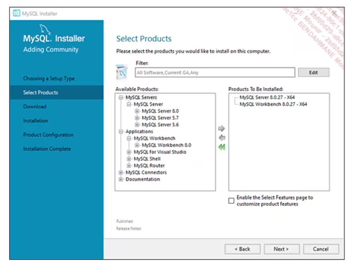
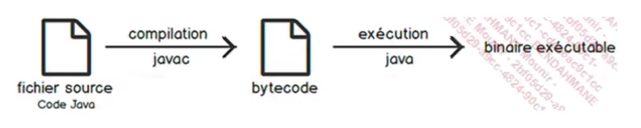
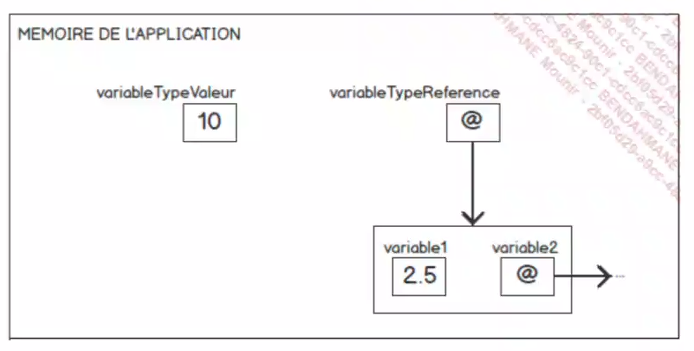
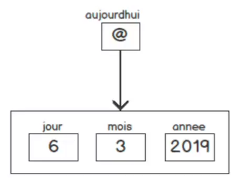
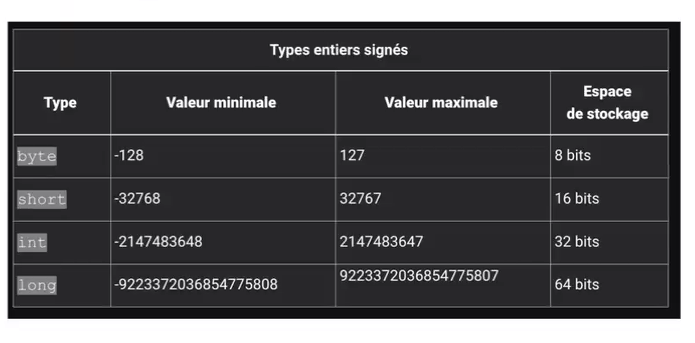
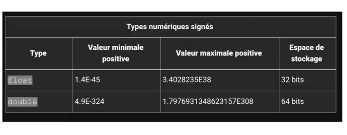

#jave

JAVA:

- Langage systeme simple, orienté objet et interprété,
- optimisation du temps des cycles de dev. (complitation et execution)
- Les applications produites sont portables. 
- Par rapport au C++ Gestion de memoire et des erreurs sont simplifiées. pointeur = adresse memoire.
- il est possible de creer des applications multi threadés (capacité à effectuer des taches en meme temps).
-les appications sont très robustes et sécurisées grace a des verifications du bytecode avant éxecution.

## la plateforme JAVA



- JAVASE (standard edition) 
- installer la JDK (developement kit)
- javac : le compilateur java
- JRE (java runtime dev)environnement d'execution installer sur la machine client 
- l'outil JAVA  et l'executable qui permert d'executer mon programme.
- JVM (java virtual machine): permet l'éxecution du programme passe en param de la commande java

## La machine virtuel JAVA

elle est mise a disposition pour de multiples OS.

##### ses roles sont multiples:

- elle charge des classes (et leurs bytecode), a l'instanciation d'une classe c'est elle qui charge le bytecode à interpréter
- elle gère la mémoire :
les pointeurs et les réferences. Elle gère aussi la libération de la mémoire : Garbage collector
- elle gère aussi la sécurité
-elle gère également l'interfacage avec du code natif


## L'API JAVA

-essemble de logociel preconcu pour founir un grand nombre de fonctionalités.
L'API JAVA 17:
-21 mdules
-220 packages(l'equivalent des bibliothèque de classes en C# ou des librairies en C)
-Plus de 4000 classes interfaces mises a disposition


### Deux implementations pour une plateforme


- oracle JDK
- OpenJDK


## Votre premier programme en JAVA

un programme java est une collection de fichiers java destinés à fonctionner ensemble.



il faut plusieurs étapes pour l'éxecution d'un programme JAVA:
- compilation code source (en java) ->
bytecode (langage intermediaire).
Le bytecode n'est pas du binaire 
- c'est la JVM qui charge le bytecode et le compile à la volée du code qui sera compréhensible par la machine hote



Pour utiliser le compilateur:
```sh
javac nom_de_votre_fichier_source
```
Pour executer le bytecode:
```sh
java nom_de_votre_fichier_bytecode
```

## Structure des programmes JAVA

En Java tout est objet:
```java
public class Nom
{
    public static void main(string[] args){

    }
}
```

### Les variables en Java

instance de classe : l'objet créé à partir d'une classe 

les categories de variables :
- **les variables d'instance**: n'existe que si une instance de classe est disponible.
- **les variables de classe**: elles sont aussi declarées a l'interieur d'une classe mais avec le mot clé `static` . la variable de classe est disponible directement depuis la classe et existe en un exemplaire unique. On peut avoir50 instances d'une meme classe, mais la valeur d'une variable de classe est unique. 
- **les variables locales** sont déclarées a l'interieur d'une méthode.


##### la nomenclature:
- le nom d'une variable commence par une lettre
- lettres, chiffres et underscore
- nombre ilimité de caractères
- sensible a la casse 
- keywords
- camel case 


##### les types de variables

on distingue deux types de varoables:
- les types valeurs: celles qui stockent des valeurs
- les types references : celles qui ne stockent pas réellement de valeur



Les types valeursdesignent les types primitifs, on en compte 4 en Java : entiers,decimaux, les Chars et les bool.

Les types references designent un type plus complexe : un ensemble coherent de variables.




##### La declaration 

En Java :

``` java
[modificateur] type maVariable;
```

On peut declarer plusieurs variable du meme type sur la meme ligne:
```
type var1, var2, var3,...;
```
Exemple:
``` java
int ageDeTom;
Date armistice, noel;
```

Pour initialiser une variable:
``` java
int frenchWorldCupYear = 1998;
```

Les types d'entiers



Les types decimaux



Les constantes

c'est une variables qu'on ne doit pas etre modifier pendant l'execution du programme:
il convient alors de definir des constantes 

Pour definir une constante on utilise le mot cle 
`final`:
```java
    final double PI = 3,1415926535897932384626433832795028841971693993751058;
```

L'initialisation de la constante est obligatoire lors de sa declaration.
Souvent les constantes sont definies comme membres statiques.
Par convention on les ecrits en majuscules.

Les enumerations:
Elles permettent de definir un ensemble de constantes :
```java
    public enum Month
    {
        JANVIER,
        FEVRIER,
        MARS,
        AVRIL,
        MAI,
        JUIN,
        JUILLET,
        AOUT,
        SEPTEMBRE,
        OCTOBRE,
        NOVEMBRE,
        DECEMBRE
    }
```
L'equivalent avec une classe : 

```java
public class Month
{
    public static final int JANVIER - 0;
}
```
la declaration d'une enum peut etre considere comme l'utilisation d'une "classe caché". Cette classe herite de `java.lang.Enum`.


Pour creer un dalton :
```java
Dalton temel = Dalton.AVERELL;
```


### Les tableaux

```java

int[] unTableau;

// on doit preciser la taille de tableau
// entre crochets
unTableau = new int[122];

//avec cette syntaxe pas besoin de preciser
//la taille, elle est automatiquement determiner
int[] tableauAtailleDynamique = {3, 4, 5, 6, 8};
```

On peut acceder aux elements d'un tableau de cette maniere:

```java
autreSyntaxe[4];
```

Si vous tentez d'acceder a un index inexistant vous allez obtenir une exception de type:
`ArrayIndexOutOfBoundException`

il est possible de travailler avec des tableaux a plusieurss dimensions:
[alt text](Capture-7.PNG)

La syntaxe pour recuperer des elements dans un tableau a 2d est la suivante:

```java
int elemTableau2D = tableau2D[0][1];
```

autre methodes de création : 

```java
int[][]matrice;
matrice = new int[2][];
matrice[0]=new int[4];
matrice[1]=new int[4];
```
```java
// permet de definir un tableau 2D avec deux lignes et trois colonnes
int [][] encoreUneAutreSyntaxe = {{1, 2, 3, 4},{23, 21, 22}};
```
creez un tableaux contenant 10 string , et remplir ce tableau avec des adresses mail, exemple
[alt text](Capture-8.PNG)

Calculez le pourcentage de fournisseur de service amil.
(pour une adresse @gmail.com le fournisseur est gmail).

consultez la Javadoc :
- String : https://docs.oracle.com/en/java/javase/17/docs/api/java.base/java/lang/String.html
- 

